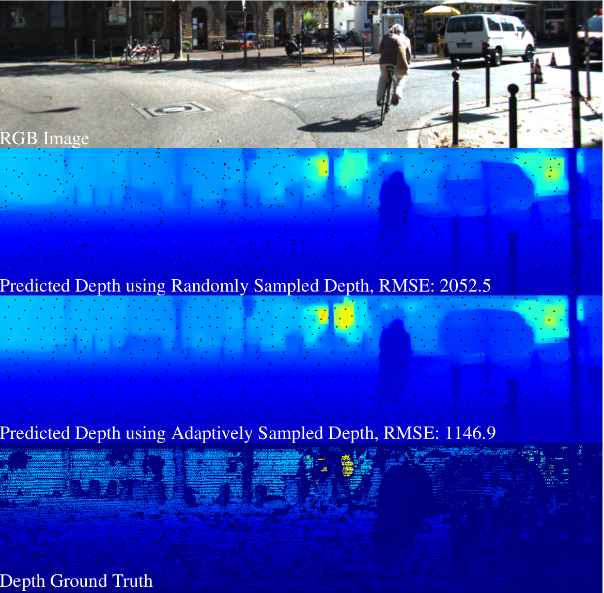
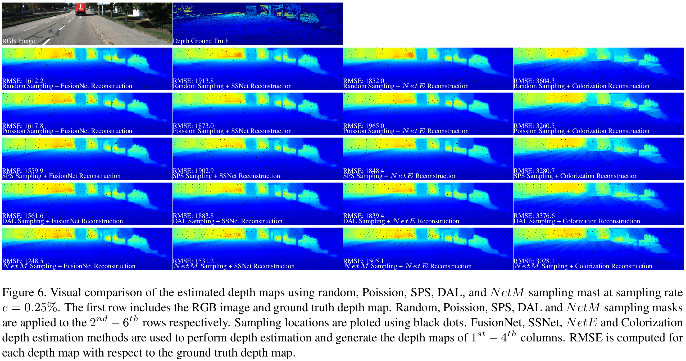

# Adaptive Depth Sampling using Deep Learning
A PyTorch implementation of the paper:
[Adaptive Illumination based Depth Sensing using Deep Learning] [[Arxiv Preprint]](https://arxiv.org/abs/2103.12297) 

## Introduction


The proposed pipeline contains two submodules, adaptive depth sampling (N etM ) and depth reconstruction (N etE). The binary adaptive sampling mask is generated based on the RGB image. Then, the LiDAR samples the scene based on the binary sampling mask and generate the sampled sparse depth map. Finally, both RGB image and sampled sparse depth map are applied to estimate the dense depth map.



LiDAR systems is able to capture accurate sparse depth map (bottom). Reducing the number of samples is able to increase the capture framerate. RGB image (top) can be applied to fuse with the captured sparse depth data and estimate a dense depth map. We demonstrate that choosing the sampling location is im-
portant to the accuracy of the estimated depth map. Under 0.25% sampling rate (with respect to the RGB image), using the same depth estimation method, the depth map estimated from the adaptively sampled sparse depth (third row) is more accurate than the depth map estimated from random samples (second row).




## Requirements
- [Anaconda](https://www.anaconda.com/download/)
- [PyTorch](https://pytorch.org/)
- opencv
```
conda install -c conda-forge opencv
```
- [tensorboard_logger](https://github.com/TeamHG-Memex/tensorboard_logger)
```
pip install tensorboard_logger
```

## Datasets

### Train and Val Dataset
The train and val datasets are sampled from [KITTI-depth-completion](http://www.cvlibs.net/datasets/kitti/eval_depth.php?benchmark=depth_completion).
Train dataset has 42949 images. Val dataset has 3426 images. We use a [traditional image inpainting algorithm](https://www.cs.huji.ac.il/~yweiss/Colorization/) to densify the semi-dense ground truth depth data. 
Download the datasets from [here](TBD), 
and then extract it into `$data` directory. Modify the path of `$data` directory in line#34/35 of file train_SparseD2DenseD.py, line#49/50 of file train_SuperPixelFCN_color.py and line#XX/XX of file train_NetM.py.

## Usage

### Train NetE

Run
```
python train_SparseD2DenseD.py
```
to train the RGB and Sparse Depth Completion network NetE.

### Train NetFCN

Run
```
python train_SuperPixelFCN_color.py
```
to train the FCN super pixel network using the SLIC loss. NetFCN is used as initialization of NetM.

### Train NetM

After NetE and NetFCN are trained, modify the file name of trained NetE in line#29 of file train_NetM.py and run
```
python train_NetM.py
```
to train the adaptive image sampling network NetM.

To visualize the training process, run
```
tensorboard --logdir tensorBoardRuns
```

### Test NetE
```
python test_NetE_h5.py
```
The output reconstructed images are in `results/netE_results` directory.

### Test NetM
```
python test_NetM_h5.py
```
The output reconstructed images are in `results/netM_results` directory.

